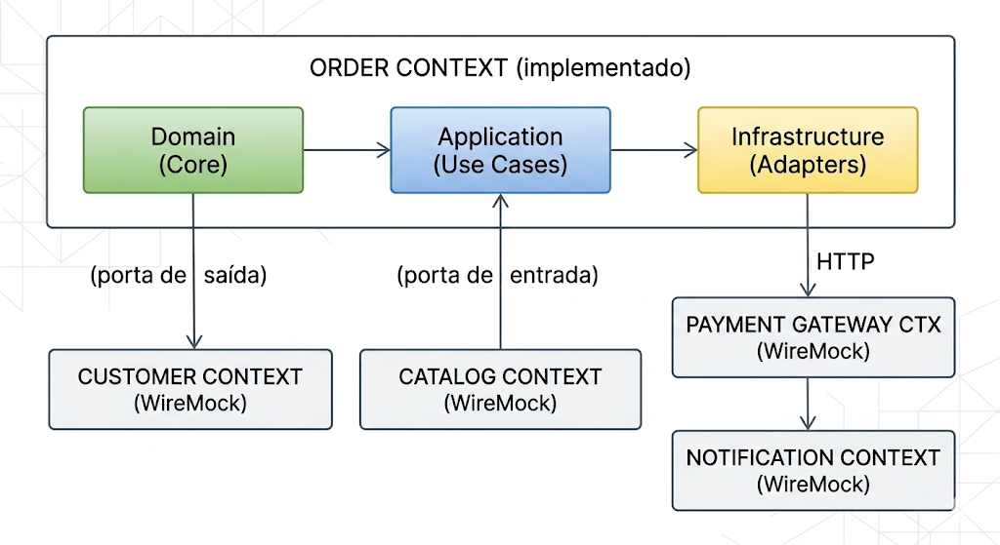

# Documentação Arquitetural — Order Service

## 1. Decomposição do Domínio

O **Order Service** é o único serviço implementado nesta plataforma de e-commerce e é responsável pelo ciclo de vida completo de um pedido, desde sua criação até a liquidação financeira.

### Agregados e Entidades de Domínio

| Conceito        | Tipo      | Responsabilidade                                                                           |
|-----------------|-----------|--------------------------------------------------------------------------------------------|
| `Order`         | Agregado  | Raiz do agregado de pedido. Gerencia o ciclo de vida (PENDENTE → CONFIRMADO → CANCELADO). |
| `OrderItem`     | Entidade  | Representa um produto dentro do pedido, com quantidade e preço unitário calculado.        |
| `OrderStatus`   | Value Object (Enum) | Encapsula as regras de transição de estado do pedido.                            |
| `Payment`       | Agregado  | Raiz do agregado de pagamento. Gerencia PROCESSING → APPROVED/REJECTED.                  |
| `PaymentStatus` | Value Object (Enum) | Encapsula as transições válidas de um pagamento.                                 |

### Casos de Uso (Portas de Entrada)

| Caso de Uso                   | Operação                                                              |
|-------------------------------|-----------------------------------------------------------------------|
| `CreateOrderUseCase`          | Cria um novo pedido após validar o cliente via serviço externo.      |
| `AddItemToOrderUseCase`       | Adiciona item ao pedido validando estoque e preço no catálogo.       |
| `RemoveItemFromOrderUseCase`  | Remove item de um pedido ainda em edição.                            |
| `ConfirmOrderUseCase`         | Confirma o pedido e calcula o total.                                 |
| `CancelOrderUseCase`          | Cancela o pedido segundo as regras de ciclo de vida.                 |
| `GetOrderByIdUseCase`         | Consulta os detalhes de um pedido por ID.                            |
| `ListOrdersByCustomerUseCase` | Lista todos os pedidos de um cliente.                                |
| `ProcessPaymentUseCase`       | Aciona a cobrança no gateway externo e registra o pagamento.        |
| `ProcessPaymentCallbackUseCase` | Processa o webhook do gateway e envia notificação após aprovação. |
| `GetPaymentStatusUseCase`     | Consulta o status atual de um pagamento.                             |

---

## 2. Bounded Contexts

A plataforma de e-commerce foi decomposta nos seguintes Bounded Contexts. O `order-service` implementa o contexto central:

### Contextos e Responsabilidades

| Bounded Context    | Responsabilidade                                                  | Implementação     |
|--------------------|-------------------------------------------------------------------|-------------------|
| **Order**          | Ciclo de vida dos pedidos, regras de negócio, idempotência        | Este serviço      |
| **Customer**       | Cadastro e validação de clientes (ativo/bloqueado)                | WireMock stub     |
| **Catalog**        | Inventário de produtos, preços e controle de estoque              | WireMock stub     |
| **Payment Gateway**| Processamento financeiro das cobranças                            | WireMock stub     |
| **Notification**   | Envio de notificações (e-mail, SMS, push) ao cliente              | WireMock stub     |

---

## 3. Justificativas Técnicas (ADRs)

### ADR-001: Arquitetura Hexagonal (Ports & Adapters)

**Status:** Aceito

**Contexto:** O serviço precisa integrar-se com múltiplos sistemas externos (banco de dados, gateway de pagamento, serviço de clientes, catálogo, notificações). É fundamental que as regras de negócio não dependam de detalhes de infraestrutura.

**Decisão:** Adotamos a **Arquitetura Hexagonal** (Ports & Adapters), onde:
- O **domínio** (entidades, casos de uso, value objects) é completamente independente de frameworks.
- **Portas de entrada** (`*UseCasePort`) definem os contratos que os adaptadores de entrada (controllers REST) devem respeitar.
- **Portas de saída** (`*Port`) definem os contratos que os adaptadores de saída (JPA, RestClient) devem implementar.
- A **inversão de dependência (DIP)** garante que o domínio nunca instancia ou conhece adaptadores concretos.

**Consequências:**
- ✅ O núcleo de domínio pode ser testado com 100% de isolamento via mocks das portas.
- ✅ Substituição de adaptadores (ex: trocar MySQL por PostgreSQL, ou WireMock por um serviço real) sem tocar no domínio.
- ✅ Facilita a migração futura para arquitetura de microsserviços ou event-driven.
- ⚠️ Maior quantidade de interfaces e classes, aumentando a verbosidade inicial do projeto.

---

### ADR-002: Controle de Idempotência via Cabeçalho `Idempotency-Key`

**Status:** Aceito

**Contexto:** Operações mutáveis (criação de pedidos, processamento de pagamento) podem ser repetidas por clientes em caso de timeout ou falha de rede, causando duplicação de dados.

**Decisão:** Implementamos um filtro de infraestrutura (`IdempotencyFilter`) que:
1. Intercepta requisições `POST` e `DELETE` ao verificar o cabeçalho `Idempotency-Key`.
2. Armazena a resposta da primeira execução bem-sucedida no banco de dados (`idempotency_keys`).
3. Em requisições subsequentes com a mesma chave, retorna a resposta cacheada sem reprocessar.

**Consequências:**
- ✅ Segurança contra duplicação de pedidos e cobranças duplicadas em webhooks.
- ✅ Conformidade com boas práticas de APIs REST (padrão adotado por Stripe, PayPal, etc.).
- ⚠️ Overhead de persistência adicional por requisição mutável.

---

### ADR-003: Resiliência com Circuit Breaker (Resilience4j)

**Status:** Aceito

**Contexto:** O serviço depende de APIs externas (Customer Service, Catalog Service, Payment Gateway) que podem ficar instáveis ou indisponíveis. Chamadas em cascata a serviços com falha podem degradar toda a plataforma.

**Decisão:** Adotamos o padrão **Circuit Breaker** via **Resilience4j** em todos os adaptadores HTTP de saída:
- **CLOSED**: Chamadas normais ao serviço externo.
- **OPEN**: Após `failureRateThreshold=50%` de falhas em uma janela deslizante de `slidingWindowSize=10` chamadas, o circuit abrir por `waitDurationInOpenState=10-30s`, retornando imediatamente via método de fallback.
- **HALF-OPEN**: Após o período de espera, permite `permittedNumberOfCallsInHalfOpenState=3` chamadas de teste para verificar a recuperação.

**Fallback Strategy:**
- Para `CustomerService` e `CatalogService`: Lança `DomainException` com mensagem de indisponibilidade temporária (HTTP 422 para o cliente).
- Para `PaymentGateway`: Lança `DomainException` sinalizando que a cobrança não pôde ser processada.
- Para `NotificationService`: Falha silenciosa com log de aviso (notificações não são críticas para a consistência do pedido).

**Consequências:**
- ✅ Proteção contra falhas em cascata (*cascading failures*).
- ✅ Degradação elegante (*graceful degradation*) com mensagens de erro claras.
- ✅ Recuperação automática quando o serviço externo voltar ao normal.
- ⚠️ Configuração adequada dos thresholds é necessária para evitar falsos positivos em picos de tráfego.

---

### ADR-004: Segurança com JWT e RBAC (OAuth2 Resource Server)

**Status:** Aceito

**Contexto:** A API precisa garantir que somente usuários autenticados e autorizados possam realizar operações, com controle granular por tipo de operação.

**Decisão:** Configuramos o Spring Security como **OAuth2 Resource Server** com validação de tokens JWT assinados com HMAC-SHA256:
- `orders:write` — permite criar, adicionar itens, confirmar e cancelar pedidos.
- `orders:read` — permite consultar pedidos.
- `payments:write` — permite iniciar pagamentos e processar callbacks.
- `payments:read` — permite consultar status de pagamento.

Erros de autenticação/autorização são mapeados para o padrão **RFC 7807** (Problem Details) via `GlobalExceptionHandler`.

**Consequências:**
- ✅ RBAC granular sem acoplamento ao mecanismo de identidade.
- ✅ API completamente stateless (sem sessões).
- ✅ Conformidade com OWASP Top 10 (A01: Broken Access Control).

---

### ADR-005: Observabilidade com OpenTelemetry e Micrometer

**Status:** Aceito

**Contexto:** Em arquiteturas distribuídas, rastrear o fluxo de uma requisição entre serviços é essencial para diagnóstico de problemas em produção.

**Decisão:** Adotamos:
- **Micrometer Tracing + OpenTelemetry Bridge**: Gera `traceId` e `spanId` automaticamente para cada requisição, propagando via cabeçalhos W3C TraceContext entre serviços.
- **Logback com Logstash Encoder**: Formata todos os logs como JSON estruturado, incluindo `traceId` e `spanId` do MDC automaticamente.
- **Micrometer + Prometheus**: Expõe métricas operacionais em `/actuator/prometheus` para coleta pelo Prometheus e visualização no Grafana.

**Consequências:**
- ✅ Correlação automática de logs com traces distribuídos.
- ✅ Diagnóstico rápido de latências e erros em produção.
- ✅ Logs estruturados em JSON permitem consultas eficientes em ferramentas como Elasticsearch/Kibana.
