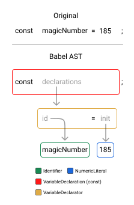

# Por que o CSS em JS é lento?

Publicado em 26 de agosto de 2024 por Corbin Crutchley - [Artigo Original](https://playfulprogramming.com/posts/why-is-CSS-in-JS-slow)

## TLDR;
Soluções CSS em JS como `Styled Components` e `Emotion CSS` permitem folhas de estilo complexas usando conhecimento de JavaScript, mas elas vêm com desvantagens de desempenho. A análise tradicional de CSS no navegador é rápida, mas não gratuita, e o CSS em JS adiciona etapas adicionais que podem tornar a renderização mais lenta. Algumas ferramentas modernas como [StyleX](https://stylexjs.com)[1](https://github.com/facebook/stylex) e [PandaCSS](https://panda-css.com) atenuam esses problemas compilando CSS no momento da construção em vez do tempo de execução. Entender essas nuances é crucial para selecionar a abordagem de estilo correta para seu projeto.

## Introdução

Se você já trabalhou com frameworks como React, Angular ou Vue, provavelmente já usou (ou ouviu falar de) uma solução CSS em JS como [Styled Components](https://styled-components.com/), [Emotion CSS](https://emotion.sh/docs/introduction) ou ainda [JSS](https://cssinjs.org/).

Embora esses frameworks tenham o superpoder de reutilizar o conhecimento existente de JavaScript para gerar folhas de estilo complexas, eles vêm com sua cota de desvantagens.

Muitos difamadores do CSS em JS têm um problema comum com o conceito da ferramenta como um todo: `CSS em JS é lento`.

Aqui está a verdade infeliz: isso está correto.

Não me entenda mal, eu gosto do CSS em JS para certos projetos; mas é desafiador (ou muitas vezes impossível) fazer uma solução CSS em JS ser tão rápida quanto o CSS vanilla.

Vamos explorar o porquê disso, o que algumas bibliotecas fizeram para contornar o problema e muito mais.

## Como o CSS é analisado

Como qualquer outra linguagem de alto nível, o CSS é escrito em texto simples. Embora tenhamos destaque de sintaxe especial em nossos IDEs para CSS, não há razão para que você não possa escrever CSS no bloco de notas e fazê-lo funcionar da mesma forma.

Por exemplo:

```
p {
  color: red;
}
```

Ainda é construído usando caracteres ASCII. `p` ainda é uma string de `"p"` independentemente de estar em um arquivo `.css` ou se estiver em um arquivo `.txt`.

Para **realmente** enfatizar o ponto, você pode até apontar para um arquivo `.txt` (com sintaxe CSS válida) em um elemento `<link>` para vinculá-lo a um arquivo HTML como uma folha de estilo:

```
<!-- Isso é válido e funciona -->
<link rel="stylesheet" href="styles.txt" />
```

"Então por que isso?"

Bem, isso ocorre porque o CSS é "analisado" em uma linguagem legível por máquina por meio de uma "Árvore de Sintaxe Abstrata" (AST).



Embora a semântica exata disso não seja muito importante agora, saiba que esse processo - embora rápido - não é gratuito e pode levar alguns ciclos da sua CPU para ser processado. Na verdade, quanto maior for sua folha de estilo, mais tempo essa análise levará antes que o CSS possa ser processado e usado para estilizar sua marcação.

Você pode aprender mais sobre como o código-fonte é transformado em códigos executáveis ​​compreensíveis por máquina no artigo [Como os computadores falam](https://playfulprogramming.com/posts/how-computers-speak).

## Entendendo os riscos da análise sintática

"Por que a análise sintática de CSS é importante para mim?"

Bem, é importante porque essa análise sintática é como seu navegador descobre como quer estilizar as coisas.

Vamos diminuir o zoom por um momento e pensar sobre como o CSS aparece em nossa tela usando mecanismos de carregamento CSS tradicionais. Digamos que temos uma tag `<style>` carregada em um arquivo HTML como este:

```
<!-- index.html -->
<!doctype html>
<html>
	<head>
  	<style>
     	/* ... */
    </style>
	</head>
	<body>
    <!-- ... -->
	</body>
</html>
```

Quando esta folha de estilo é detectada em nosso arquivo HTML, ela bloqueará a exibição do conteúdo do arquivo HTML até que o CSS termine de analisar e esteja pronto para estilizar a página de `forma síncrona` antes que o navegador possa mostrar seu conteúdo (ou "pintar").


Essa capacidade de bloquear a exibição do HTML para o usuário nos permite evitar cenários em que queremos ocultar o conteúdo no carregamento inicial, mas, como o estilo ainda não foi carregado, ele é exibido de qualquer maneira:

```
<p class="hide-me">Shh, it's a secret!</p>
<style>
  .hide-me {
    display: none;
  }
</style>
```

Se você tentar esse pedaço de código, talvez perceba a tela piscando.

Esse piscar de conteúdo é frequentemente chamado de "Flash de conteúdo sem estilo" (FOUC, flash of unstyled component).

### CSS em JS dentro da seção HEAD

Agora vamos dar uma olhada na mesma cadeia de cascata se movermos nossa geração CSS para uma tag `<script>` dentro da seção `<head>`:

```
<!DOCTYPE html>
<html lang="en">
  <head>
    <script>
      const styleTag = document.createElement('style');
      styleTag.innerText = `  p {    display: none;  }`;
      document.head.append(styleTag);
    </script>
  </head>
  <body>
    <p class="hide-me">Shh, it's a secret!</p>
  </body>
</html>
```

Aqui, carregamos uma tag `<style>` no `<head>` por meio de um snippet JavaScript também carregado no `<head>`. Isso significa que o JS precisará ser analisado antes de poder executar o código para gerar o CSS, então esse CSS precisa ser analisado até que finalmente possa ser exibido completamente.


Isso não é o ideal, mas também não é o pior. Infelizmente, no entanto, não é representativo de como o CSS em JS realmente funciona.

Afinal, a maioria dos projetos baseados em framework não tem suas tags `<script>` em `<head>`. Em vez disso, eles podem optar por fazer algo parecido com:

```
<!DOCTYPE html>
<html lang="en">
  <body>
    <div id="root"></div>
    <script>
      render(document.querySelector('#root'));
    </script>
  </body>
</html>
```

Isso nos permite esperar até que o elemento raiz tenha sido criado antes que ele possa injetar a marcação do framework nele.

Vamos explorar como essa cadeia evolui quando movemos nossa tag `<script>` para `<body>`, então.

### CSS em JS dentro da seção body

Movendo nosso código para o body:

```
<!DOCTYPE html>
<html lang="en">
  <body>
    <p class="hide-me">Shh, it's a secret!</p>
    <script>
      const styleTag = document.createElement('style');
      styleTag.innerText = `  p {    display: none;  }`;
      document.head.append(styleTag);
    </script>
  </body>
</html>
```

Apresentamos outra etapa em nossa pequena cadeia em cascata: agora o navegador exibe o DOM antes de analisar o JS.


Isso não é o ideal, mas ainda falta outra etapa que precisamos fazer antes que seja emblemático do uso do framework CSS em JS.

### Framework CSS em JS

Veja, enquanto nosso código anterior executa imediatamente a lógica `document.createElement('style')`, o mesmo não pode ser dito para todos os frameworks que usam esta solução.

Seu framework precisa criar a marcação para o componente entrypoint `<App/>` e renderizá-lo. Dependendo do seu framework, isso pode acontecer de forma assíncrona a partir da análise do JS.

Da mesma forma, sua biblioteca CSS em JS pode não renderizar o CSS de forma síncrona com a primeira renderização do seu componente. Como resultado, você pode obter dois FOUCs; uma vez quando o HTML é baixado sem a marcação do framework renderizada, a segunda quando o framework renderiza sem o CSS injetado ainda.


## CSS em JS compilado

"Mas nem todas as soluções CSS em JS são lentas!"

Isso é verdade. Se você estiver usando soluções como StyleX, PandaCSS ou Vanilla Extract, provavelmente não encontrará esses mesmos problemas de desempenho de cascata de JS para CSS.

No entanto, a razão pela qual essas estruturas não são lentas é porque elas contornam a parte "JavaScript" do problema quase completamente.

Veja, todas essas ferramentas utilizam um compilador de algum tipo para compilar do JavaScript em tempo de execução para CSS compilado. Por exemplo, este código PandaCSS:

```
import { css } from './styled-system/css'

export function App() {
  return <div className={css({ bg: 'red.400' })} />
}
```

Pode compilar para algo assim durante a compilação do seu site, na sua máquina de desenvolvedor:

```
<!DOCTYPE html>
<html lang="en">
  <head>
    <style>
      .bg_red\.400 {
          background: var(--colors-red-400);
      }
    </style>
  </head>
  <body>
    <!-- ... -->
  </body>
</html>
```

```
// App.jsx
import { css } from './styled-system/css'

export function App() {
  return <div className={"bg_red.400"} />
}
```

Isso nos leva de volta a esse problema:


Para o espaço do problema original assim:


```
[!] Não apenas essas ferramentas

Anteriormente, mencionei uma lista de bibliotecas CSS em JS que eram lentas e aquelas que compilavam para CSS. Embora isso seja geralmente verdade, nem sempre é tão preto no branco.

Afinal, algumas bibliotecas têm plugins ou compatibilidade com SSR para reduzir ou resolver os problemas com CSS em JS, conforme descrito.
```

[SSR](https://playfulprogramming.com/posts/what-is-ssr-and-ssg)

## Conclusão

Espero que esta tenha sido uma visão perspicaz de como diferentes soluções CSS em JS funcionam por baixo dos panos e por que você pode ou não querer selecionar uma biblioteca em vez de outra.
